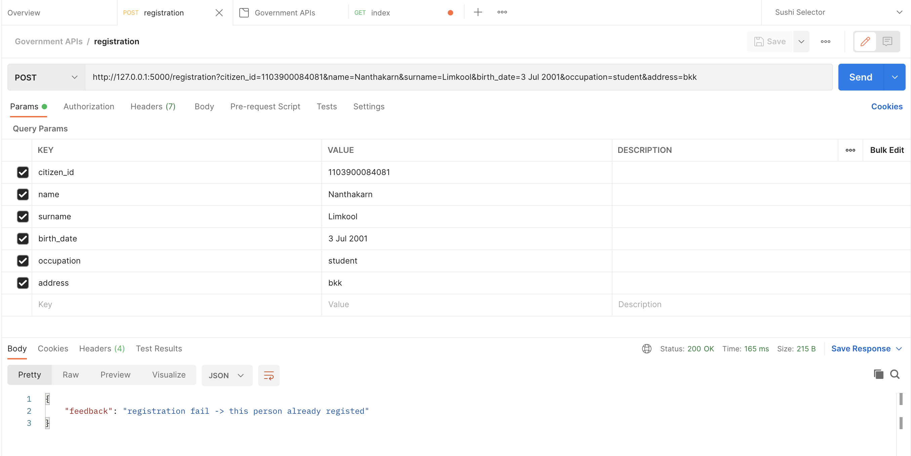

# Government APIs

## Installation

Create .env file

```.env
ENV=development
DEBUG=True
SQLALCHEMY_DATABASE_URI=postgresql://<USERNAME>:<PASSEORD>@localhost/government
```

## APIs

- (index)
- POST: /registration -> add a person data to database 'citizen'
  
- GET: /citizen -> check citizen table

## Basic CMD

```zsh
# install dependencies
> pipenv shell
# install pip to pipFile
> pipenv install <PACKAGE_NAME>

# create requirements.txt
> pip freeze > requirements.txt
```

```zsh
# initial database
> from app import db
> db.create_all()
```
