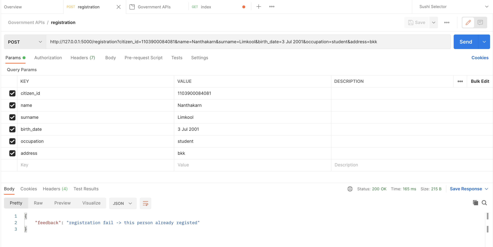

# Government APIs

<https://wcg-apis.herokuapp.com/>

## Installation

### Required Dependency

This project runs on Python 3.6 or higher. It also uses virtualenv to manage virtual environments.

#### Other Required Software Packages

These additional packages need to be installed too. All of them are listed in the requirements.txt.

| Name             | Currently use version | Notes                                                     |
| ---------------- | --------------------- | --------------------------------------------------------- |
| Flask            | 2.0                   | A simple framework for building complex web applications. |
| Flask-SQLAlchemy | 2.5.1                 | Adds SQLAlchemy support to your Flask application.        |
| gunicorn         | 20.1.0                | WSGI HTTP Server for UNIX.                                |
| psycopg2         | 2.9.1                 | psycopg2 - Python-PostgreSQL Database Adapter.            |
| psycopg2-binary  | 2.9.1                 | psycopg2 - Python-PostgreSQL Database Adapter.            |
| SQLAlchemy       | 1.4.25                | Database Abstraction Library.                             |

Create .env file

```.env
DEBUG=True
SQLALCHEMY_DATABASE_URI=postgresql://<USERNAME>:<PASSEORD>@localhost/government
```

Create a new virtual environment (first time only)

```bash
virtualenv env
```

Activate the virtual environment

On Linux or MacOs:

```bash
. env/bin/activate
```

On Windows:

```bash
env\Scripts\activate
```

Install the required packages (first time only)

```bash
pip install -r requirements.txt
```

Run [app.py](app/app.py)

## APIs

- [/index](https://wcg-apis.herokuapp.com)

- [/registration](https://wcg-apis.herokuapp.com/registration)

  - GET: API usage, detail, format
  - POST: add a person data to database 'citizen'
    

- [/citizen](https://wcg-apis.herokuapp.com/citizen)
  - GET: check citizen table
  - DELETE: reset citizen table (delete all rows)

## Basic CMD

```zsh
# install dependencies
$ pipenv shell
# install pip to pipFile
$ pipenv install <PACKAGE_NAME>

# create requirements.txt
$ pip freeze > requirements.txt
```

set up datatabase

```
$ cd app
$ python
```

```python shell
> from app import db

# reset database
> db.drop_all()

# initial database
> db.create_all()
```
